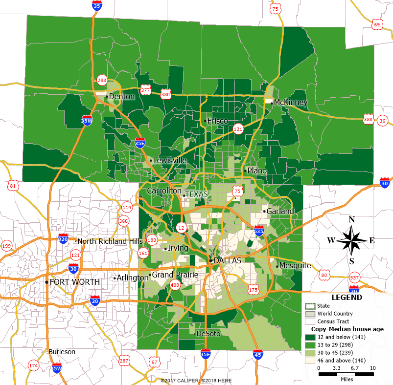

```{r setup, include=FALSE}
knitr::opts_chunk$set(echo = TRUE)
```

## R Markdown

This is an R Markdown document. Markdown is a simple formatting syntax for authoring HTML, PDF, and MS Word documents. For more details on using R Markdown see <http://rmarkdown.rstudio.com>.

When you click the **Knit** button a document will be generated that includes both content as well as the output of any embedded R code chunks within the document. You can embed an R code chunk like this:

```{r cars}
summary(cars)
```

## Including Plots

You can also embed plots, for example:

```{r pressure, echo=FALSE}
plot(pressure)
```

Note that the `echo = FALSE` parameter was added to the code chunk to prevent printing of the R code that generated the plot.

## Objective
The main purpose of this project is to identify and evaluate the factors that influence the median home value at census tract level. Segmenting it, the following are the expected outcomes of the project:  
a. Identification of the variables at census track level and at site level that influence house prices.  
b. Analyze the spatial patterns of the neighborhood characteristics such as Demographics, school quality, travel time to work and so on.  
c. Build a hedonic pricing model and calculate the coefficients that determines the buyer’s willingness to pay for additional characteristics.

## Preliminary Analysis
In general when we think about the factors that influence house prices at Census Track level, the first thing comes to the mind are *Per capita income, Median Number of rooms and vacancy rates at  neighbourhood effects. From the literature review, many other variables such as Median House Price, Floor Space, Age | School District | Distance to CBD , No of Job Opening per person | Distance to Major Road* were also discussed. 

Table Header      
-----------,-----------,-----------,-----------,-----------,  
Median House Price, Floor Space, Age | School District | Distance to CBD 
No of Job Opening per person | Distance to Major Road 


```{r}
smoke <- matrix(c("Median_House_Price", 'Floor_Space, Age' , 'School_District' , 'Distance2CBD', 'No_of_JobOpening_perperson' , 'Distance2MajorRoad'), ncol = 2, byrow = TRUE)

```

So, after careful examination the following variables are considered for the preliminary analysis. **Population growth, Median House Age, Percapita Income, Population growth rate, School District, Distance to CBT, Vacancy rate, Median no of Rooms, House price Index**. 

## Study Area
Obviously, City of Dallas/ Dallas County is the most preferred location because of the Knowledge about local markets. As both City and Metroplex are huge in size, I opted to chose a portion of area. The points that are considered while choosing the study area are as follows: 

```{r}
library(leaflet)
leaflet() %>%
   setView(-96.800902, 32.780762, zoom = 10) %>% 
   addTiles() %>%
   addMarkers(-96.800902, 32.780762, popup = "Dallas") 
```


To build an accurate regression model, the sample population should have good variance that can reflect variance of the total population. So all three counties- Dallas, Collin, Denton are analyzed for spatial patterns with respect to the age of the houses and Per capita income levels.   

**Median House Age:** Spatial clustering of same age houses reflects the growth of any city. As most of the north american cities are designed as monochromatic models, the residential houses near to the Central business district were built earlier and due to the growth, new houses were built on teh pheriphery of the city boundaries. This phenomenon can be clearly observed in Dalals County. Most of the early built houses are with in the circular boundary of I635 and I20. 
The following image illustrates the spatial pattern of it. 

Image: 


**Per Capita Income:**
