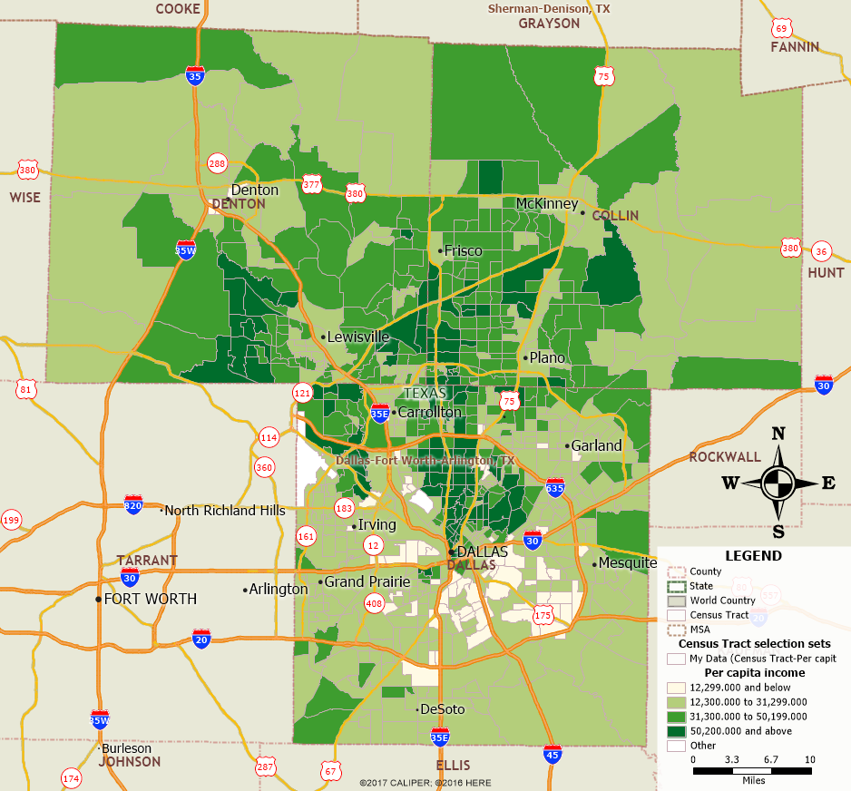

```{r setup, include=FALSE}
knitr::opts_chunk$set(echo = TRUE)
```

## R Markdown

This is an R Markdown document. Markdown is a simple formatting syntax for authoring HTML, PDF, and MS Word documents. For more details on using R Markdown see <http://rmarkdown.rstudio.com>.

## Project Overview

* Objective
* Project Scope and Preliminary Analysis  
    + Study Area
* Data Collection
* Exploratory Analysis
    + Univariate Analysis
* Data Cleaning and Data Modeling
* Model Building
    + Correlation Analysis 
    + Residual Analysis
    + Variable transformations
* Comparing Regression Models (Tentative) 
* Insights

## Objective
The main purpose of this project is to identify and evaluate the factors that influence the median home value at census tract level. Segmenting it, the following are the expected outcomes of the project:  
a. Identification of the variables that influence house prices at census track level and at site level.  
b. Analyze the spatial patterns of the neighborhood characteristics such as Demographics, school quality, travel time to work and so on.  
c. Build a hedonic pricing model and calculate the coefficients that determines the buyer’s willingness to pay for additional characteristics.


## Preliminary Analysis

In general when we think about the factors that influence house prices at Census Track level, the first thing comes to the mind are *Per capita income, Year Build and vacancy rates at  neighbourhood effects. In many prominent academic literatures, many other variables such as Median House Price, Floor Space, Median Age of pOpulation, School District, Distance to CBD , No of Job Opening per person, Distance to Major Road* were discussed. 

### Study Area

Obviously, City of Dallas/ Dallas County is the preferred location considering the Knowledge about local market Areas. As both City and Metroplex are huge in size, I opted to chose a portion of area. 

```{r}
library(leaflet)
leaflet() %>%
   setView(-96.800902, 32.780762, zoom = 10) %>% 
   addTiles() %>%
   addMarkers(-96.800902, 32.780762, popup = "Dallas") 
```


The points that are considered while choosing the study area are as follows: 

To build an accurate regression model, the sample population should have good variance that can reflect variance of the total population. So all three counties- Dallas, Collin, Denton are analyzed for spatial patterns with respect to the age of the houses and Per capita income levels.   

**Median House Age:** Spatial clustering of same age houses reflects the growth of any city. As most of the north american cities are designed as monochromatic models, the residential houses near to the Central business district were built earlier and due to the growth, new houses were built on teh pheriphery of the city boundaries. This phenomenon can be clearly observed in Dalals County. Most of the early built houses are with in the circular boundary of I635 and I20. 
The following image illustrates the spatial pattern of it. 

Image: 

**Per Capita Income:** Value of the house is highly correlated with the average income level. So, I analyzed the per capita income by census tract level and analyzed the spatial patterns. The following image illustrates it.   

Image: 

#The Final Study Area is yet to be finalized. 

Why only these three counties!! 

As all the market analysts and economists say Dallas MSA or Dallas Metroplex area has experienced and still performing as a major growth markets in United States and also, driving the U.S GDP and Job Growth Rate. 

So after carefull examination, I witnessed that these counties have experienced a major rapid growth out of all in Texas.
Second aspect that was considered is Spatial aspect. More application and analysis with respect to the spatial aspect can be done on Census tract or Block level. 

Areas of Collin County, Dallas County, Denton County are considered for the study areas and Census Tracts level detail is considered for the spatial Analysis. 
***

## Data Collection

 After careful examination of academic literatures and also by practicality, the following variables are considered for the preliminary analysis:
● Median House Value (Dependent Variable)
● Median no of rooms
● Median house age
● HH Median Income/ HH Mean Income/ Median or Mean Family Income
● Median (Population) Age
● Mean Travel time to work
● % percentage of population with bachelor’s degree
● Homeowner Vacancy Rate
● Median Per capita Income
● No of detached houses
---------------------------------
● Independent School District
● Weighted distance to 5 employment centre / Job Proximity Index
● Dummy Variable of Golf Court
● % White Collar People

## Exploratory Data Analysis (EDA)


## Factor Analysis


